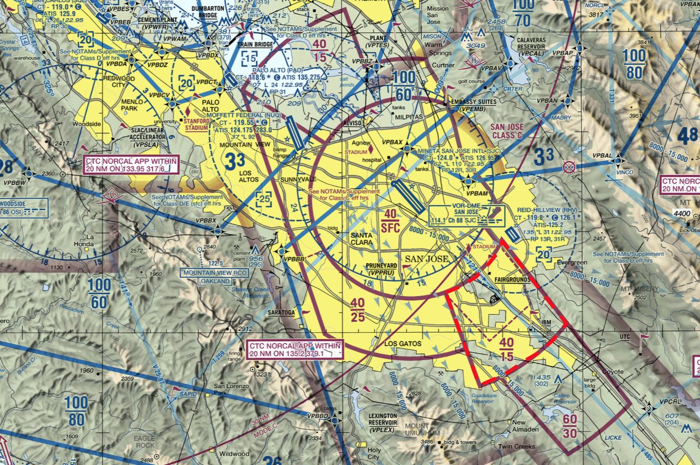
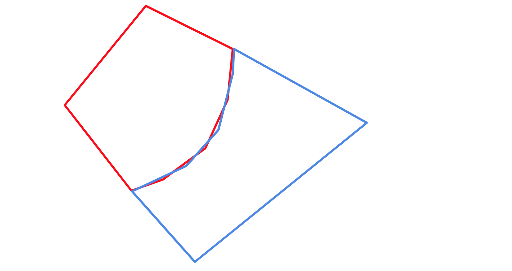
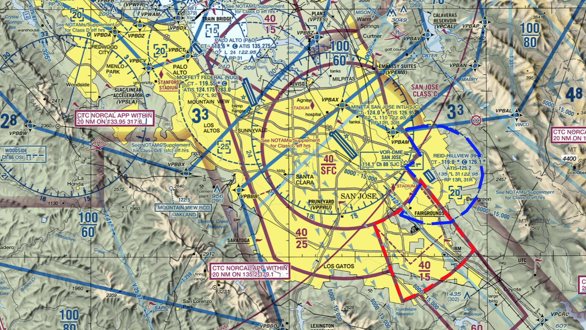
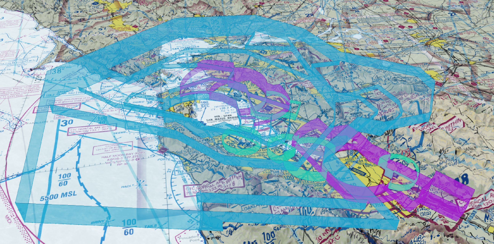

FAA Airspace Visualization
==========================

As student pilot, I've been trying to decipher FAA Sectional and Terminal Area Charts, and I found it hard to visualize some of the 3D airspaces depicted on those charts, given the 2D outlines of the different Airspace sections. It occurred to me that all the data for 3D visualization of these airspaces is available in digital format on the FAA website, so I decided to hack together a little project to illustrate how to use that data and turn it into something that you can view in your browser.

This project shows how I used the FAA data to visualize some airspaces using a bunch of python scripts, a wide variety of libraries, and some elbow grease. I live in the Bay Area, so I've focussed on those airspace first.

The outline of this project is as follows, with details on each step explained below:
* Download the required data files from the [FAA website](https://www.faa.gov/air_traffic/flight_info/aeronav/digital_products/vfr/)
* Reproject the FAA maps into a mercator projection and tile them in [TMS](https://wiki.osgeo.org/wiki/Tile_Map_Service_Specification) format
* Visualize the charts using [Cesium](https://cesiumjs.org/) (open source Google Maps/Earth)
* Process the airspace shape files into useable 3D [GLTF](https://github.com/KhronosGroup/glTF/tree/master/specification/2.0) objects
* Add the 3D airspaces to the charts using [3D tiles](https://github.com/AnalyticalGraphicsInc/3d-tiles)

The end result is an [interactive map](https://airspace.artfahrt.com/map.html) for Bay Area airspaces. Let me know what you think. Send me feedback if you have any. I'm curious to find out whether there are better ways of doing this.

*Arthur van Hoff, avh@artfahrt.com*

## Downloading data from the FAA

The first step in the process requires creating a list of available FAA Sectional (SEC) and Terminal Area (TAC) charts. All available charts are listed [here](https://www.faa.gov/air_traffic/flight_info/aeronav/digital_products/vfr/), in a human readable format.

The python script [chart_list_update.py](/src/chart_list_update.py) is designed to crawl this page using [lxml](https://lxml.de) and construct a current list of charts and store it in a [redis](https://redis.io/) table. The charts are updated regularly, so this script should be run once a week or so.

For each chart I store the name, expiration date, version number and base URL. Currently there are 56 SEC charts, 56 TAC charts, plus a few special charts for the Grand Canyon and the Carribean.

Now we need to download the chart data it self using the [chart_download.py](src/chart_download.py) script. These files are large (100MB each) and therefore I only download them once, or when a new version is available. They come in the form of a ZIP file, which contains a some meta data files, and a [TIF](https://en.wikipedia.org/wiki/GeoTIFF) file, which contains a high resolution image of the chart, as well as some information about the map projection and coordinate system that was used.

The chart images were somehow generate from some original data source. The FAA provides [28 Day NASR Subscription](https://www.faa.gov/air_traffic/flight_info/aeronav/aero_data/NASR_Subscription/) data download. This file contains a wide variety of information about airports and such, but it also includes a [SHP](https://en.wikipedia.org/wiki/Shapefile) file.

This file appears to contain some of the shape data that was used to generate the chart images. The latest version of the shape data is downloaded using the [chart_shapes_download.py](src/chart_shapes_download.py) script.

## Chart Projection

Each TIF file that was downloaded in the previous step corresponds to a physical chart. This means it includes a white border, and various other notes in the margins.

All the FAA charts use [Lambert Conformal Conic](https://en.wikipedia.org/wiki/Lambert_conformal_conic_projection) Projection. This is listed on the chart legend:

The projection is created by fitting a conic shape over the earth and projecting (lon,lat) to (x,y). Note that the North American Datum of 1983 is used. This refers to the shape of the earth. The earth is not a perfect sphere, so different map projections use different standard earth shapes.

On the San Francisco charts it is not obvious, but on the Point Barrow sectional chart, which is located in northern Alaska, the longitude lines converge noticeably.

Luckily the [pyproj](https://pypi.org/project/pyproj/) library is incredible helpful in transforming map coordinates from one projection to another.

## Tiling the Charts

The next step is to create one contiguous map by tiling the various charts using the [TMS](https://wiki.osgeo.org/wiki/Tile_Map_Service_Specification) format. This is the format used by Google Maps and Google Earth. It uses a mercator projection and represents tiles at multiple levels of resolution, so that you can zoom in gradually.

Creating the highest resolution tiles is done as follows:

1. For each chart
1. Remove the white border
1. Enumerate all the tiles at the highest resolution that overlap with the charts
1. Determine the 4 corners of the tile using the lambert projection mentioned above (this will not be a square)
1. Warp the area of tile onto a square image
1. Merge the tile into the current set of high resolution tiles

Lower resolution tiles are now created by combining 4 neighboring higher resolution tiles together.

Removing the borders, legends, and insets is not easy. There is no meta data that I know off which describes where the borders of the chars are, and removing them algorithmically is error prone. Each chart seems to use a slightly different layout, sometimes borders follow longitude or latitude lines, sometimes they are simply cut off by an edge or a straight line, sometimes there are overlays and insets.

To address this I manually examined all the charts and generated  annotations for each to remove the borders. These annotations can be found in [settings.py](src/settings.py) (I still have to do some, I've only finished the west coast).

Once the borders are filled in with transparent pixels, the chart tiles can be created. This method of warping Lambert Conformal Conical chart data to Mercator projection is **not** correct, but it is good enough to create a useable and seemingly seamless chart.

Tiling the charts is done using the [chart_tiler.py](src/chart_tiler.py) script. Here are the resulting west coast [Sectional Charts](https://airspace.artfahrt.com/sec_chart.html) and [Terminal Area Charts](https://airspace.artfahrt.com/tac_chart.html) displayed using [Cesium](https://cesiumjs.org/).

## Airspace Shapes

The airspace for an airport can be quite complex. On the chart it may consist of multiple adjoining section with different lower and upper altitudes, thus forming a complex upside down wedding cake shape which defines the 3D volume of the airspace.

We can extract the shapes of the airspace sections for an airport from the SHP file that we downloaded earlier. We can use the [shapefile](https://pypi.org/project/pyshp/) python module to read the file and extract each section.

Each section has an upper and lower altitude, and a closed polygon of (lon,lat) coordinates which describe the outline of the shape. An example is shown below, where I've outlined a section of the San Jose (SJC) airspace, with a upper altitude of 4000 MSL and a lower altitude of 1500 MSL.

All these sections together form the 3D volume of the airspace. Howerver, there is a problem. To create a single consistent 3D shape the coordinate of neighboring polygon outlines need to be exactly the same.

Unfortunately, this is no the case. I assume that when the FAA generated the data, the polygons where generate from an original shape description, each using a different starting point. As a result the coordinates do not coincide with each other.

So before we can generate a 3D shape we need to figure out which points in neighboring shapes can be considered the same, and which points lie on the line of the neighboring polygon. This is a frustratingly heuristic approach, but it seems to work well.

# Airspace Intersections

Next we need to deal with intersections between airspaces. The data is not exact in many case. In the example below the Reid-Hillview airspace with an upper limit of 2000 MSL (outlined in blue) intersects the San Jose airspace with a lower limit of 1500 MSL (outlined in red).

This can be resolved by performing a polygon intersection using [shapely](https://pypi.org/project/Shapely/) on overlapping airspace shapes and correcting the *error* in the data by creating a section of Reid-Hillview airspace with an upper limit of 1500 MSL.

# 3D Tiles

To display the airspaces in 3D on the map, we can use [3D Tiles](https://github.com/AnalyticalGraphicsInc/3d-tiles) which are supported by [Cesium](https://cesiumjs.org/).

In this case I will generate a 3D tile for each airspace so that we can toggle each airspace on/off easily. The process is as follows:

1. Project the Lon,Lat,Alt coordinates into Cesiums X,Y,Z coordinate space.
1. Generate a binary GLTF object, which is then embedded in a [B3DM](Cesium](https://cesiumjs.org/) file.
1. Generate a JSON file describing the [3D tile](https://github.com/AnalyticalGraphicsInc/3d-tiles).

The 3D tiles and associated B3Dm files are generate by the [airspace_tiler.py](src/airspace_tiler.py) script. The result is shown below.

You can also try out the interactive version on [Artfahrt](https://airspace.artfahrt.com/map.html).
